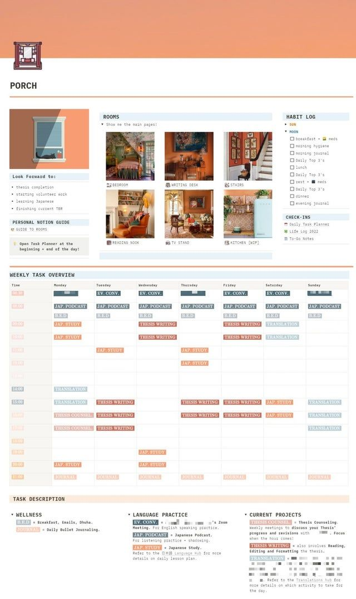
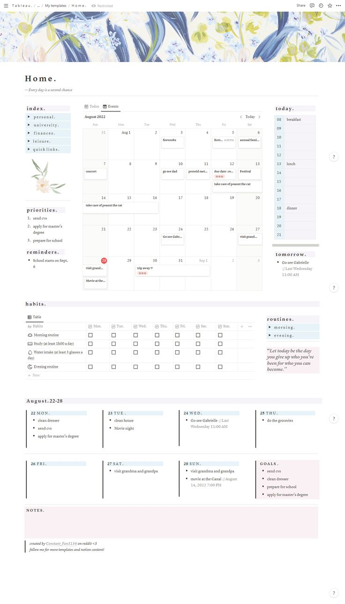
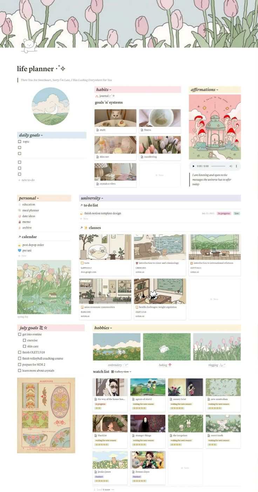
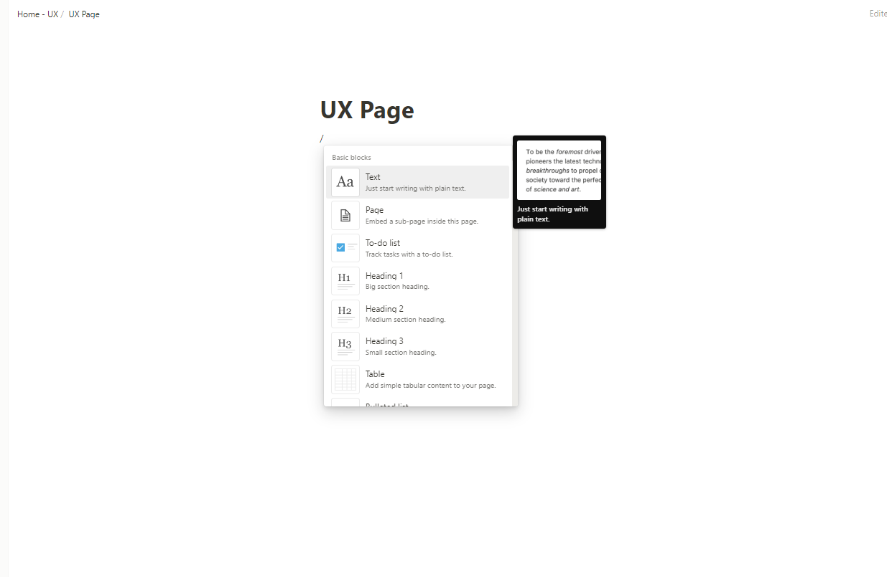
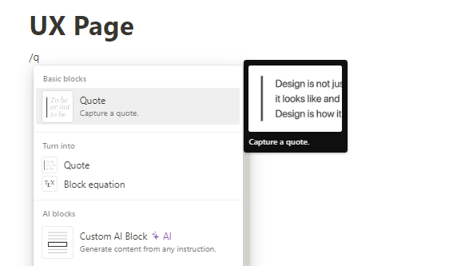
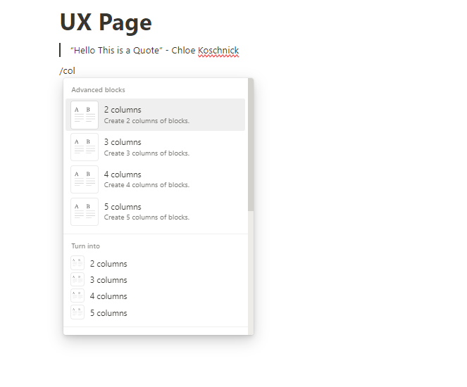
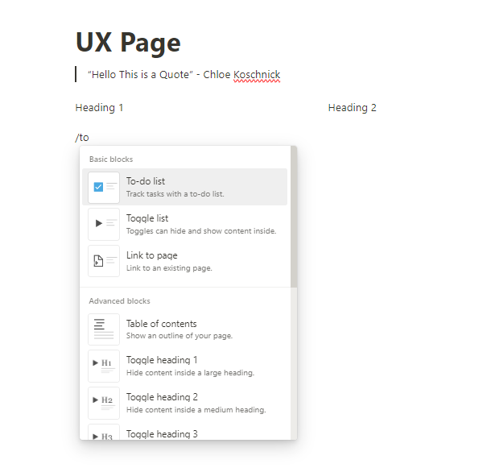
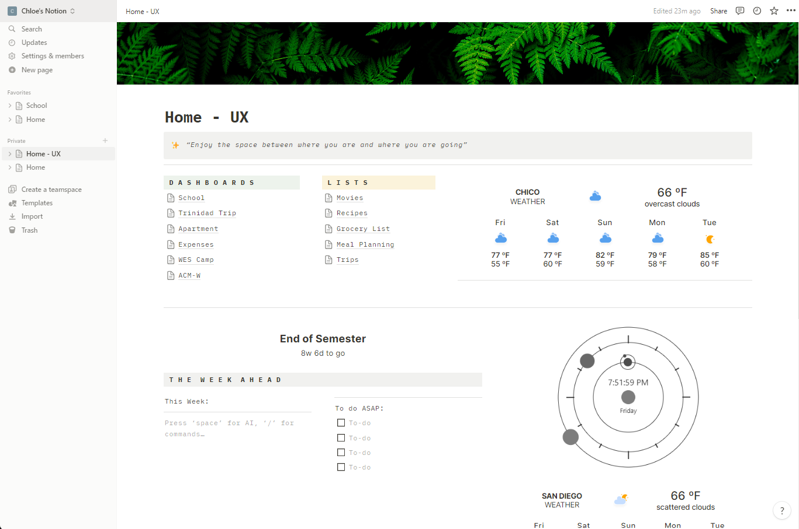

# Personal Planner with Notion
## By Chloe Koschnick

I have never been able to consistently use a planner for more than a few months at a time for a few specific reasons: I forget about them, I have a really difficult time finding one that meets all of my needs, and physical planners are not very easy to modify if things change. Even planner apps for my smartphone didn’t have everything I was looking for.  However, when I started college I desperately needed to find a solution for keeping track of everything between work and classes, which is how I found out about [Notion](https://www.notion.so/).  The easiest way to describe Notion is that it is almost like your own private and completely customizable website.  

I had found Notion after scrolling through Pinterest and continually seeing very aesthetically pleasing ‘websites’ (for lack of a better way to describe them).  For a general idea of what user’s Notion pages can look like, I will include a few below.
  

After seeing a few, I realized that Notion might fit my needs better than a planner, but I was really worried about how elaborate some of the designs I had seen were. I figured it would be incredibly difficult to use and because of that I would abandon it as quickly as my previous physical planners.  Regardless, I figured I would give it a shot. Within just an hour or two, I had a fully functional page that gave me the ability to do everything that I had been looking for years to find in a planner.  Notion has genuinely been one of the most **learnable** applications I have ever used, and similarly one of the most **memorable**.  Meaning, this app largely matches the expectations of how it is supposed to be used, and anything that doesn’t match the user’s initial expectations (mostly because it is very different from any other application out there) is a feature that is incredibly easy to remember how to use. There are definitely ways to get more complicated and add widgets from other apps, but for the most part, every single thing you need to create a fully functional page can be accessed with just the ‘/’ character.  Remembering that character is almost the only thing you need to remember in order to create a notion page.  See the images below to see just how easy it is.
   

Even though I could write pages upon pages about how much I love Notion, at first the application can be really overwhelming which can make it **unsatisfying** at first.  So after scrolling through dozens of gorgeous, intricate Notion pages and deciding I needed one, I created my account for Notion, did the short tutorial, and then was greeted by a completely blank page.  The amount of tools and widgets that Notion has, even though they are all easy to use, in overwhelming.  After an hour or two, I was able to create a page that did everything I wanted it to do, but it did not look as nice as the other pages I had seen.  For the first few months of using Notion, I was a little bit unsatisfied with how it looked.  The functionality was great, but I lacked the creativity to re-create designs I had seen previously.  It wasn’t until I spent a few hours on Pinterest looking for a design that someone had graciously posted a template for that I was remotely happy with how it looked.  Even now, I would really like to make it more aesthetic than it is.

Notion does offer templates for pages, but most of them focus primarily on functionality and not aesthetics of the page.  And, as far as I’m aware, there isn’t a way to share the aesthetic design or style across pages.  If Notion had a section in the Templates for “Community Designs” or the ability to apply a “theme” to a page, I think the user experience would be much more **satisfying**, or pleasant to use.  The initial set up of Notion would be a lot less overwhelming for most.

